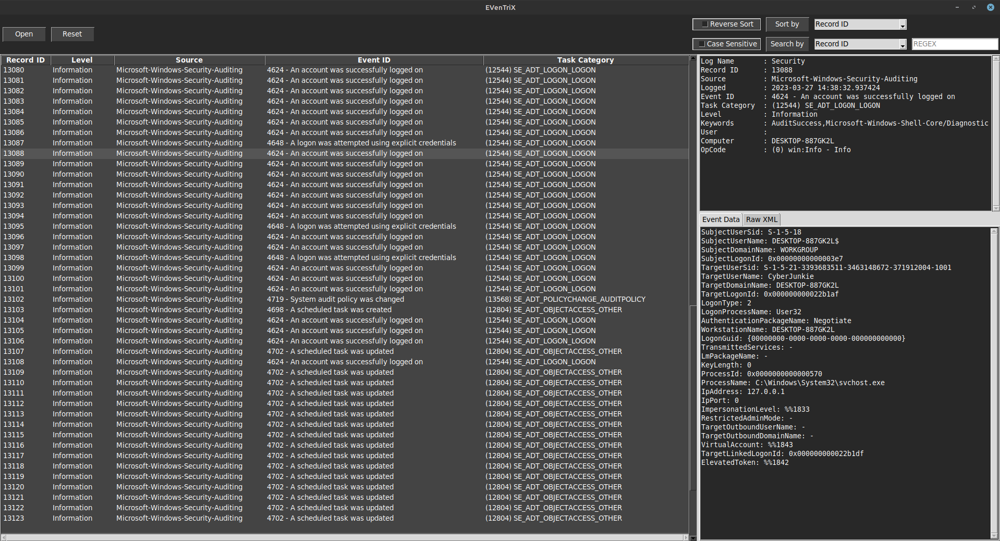

___


Eventrix is a user-friendly and portable tool designed for analyzing Windows Event Log files (.evtx). Providing a comprehensive, but simple, GUI to navigate and interpret event data, Eventrix streamlines the process of exploring EVTX events, acting as a platform agnostic alternative to Windows Event Viewer.



___
<a href='https://ko-fi.com/jacobmoore314' target='_blank'></a>

<br>

# About Eventrix
Built on Python with the TKinter GUI toolkit, it is a single script that does not require any major setup outside of a few python packages. This not only makes it portable, but allows for Linux users to also view Windows Event Logs through a comfortable graphical interface. With the simplified interface, it makes usage and navigation extremely easy without limiting any of its efficacy.

Sample Windows Event Logs have been provided for tool demonstration, named `TRY_ME_1.evtx` and `TRY_ME_2.evtx`. As the names suggest, give it a try!

# Installation & Usage
Use pip to install the packages in the provided `requirements.txt`. When done, just run the `eventrix` script with python. It really is that easy!
```bash
pip install -r requirements.txt
```

# Window Panes
### Event Pane
The Event Pane is the primary window that shows a listing of EVTX Events in a given log file. Events can be selected for focus by clicking on the event row or moving the selection up and down with the arrow keys. Selecting an event will display additional event information in the Event Info Pane, Event Data Tab, and Raw XML Tab. Column widths can be resized at your lesure by clicking and dragging the column boundary at the column headers. The Event Pane, Event Info Pane, and the Event Data/Raw XML Tabs can also be resized by clicking the boundaries between panes.

### Event Info Pane
The Event Info Pane is the top-right most pane. It displays general information about a selected event, including Log Name, Record ID, Source, Log Date/Time, Event ID, Task Category, Event Level, Keywords, User, Computer, and Opcode. This information is almost universal to every EVTX event. For some values, Eventrix will provide interpretations based on the event information.

For example, while an event's Task Category is represented as an integer in Event Logs, when paired with the Source and Event ID it corresponds to the actual category name rather than just an integer value. Eventrix does its best to present these details as often as possible to make user interpretation easier.

One of the major benefits of this interpretation is in how Eventrix handles Event IDs sourced from `Microsoft-Windows-Security-Auditing`, which is commonly associated with `Security.evtx`. In these situations, Eventrix will perform a lookup for a description assosciated with the given Event ID. For example, if the Event ID is `4624`, the Event ID column will read `4624 - An account was successfully logged on`.

### Event Data Tab
Most EVTX Events include additional event information specific to the type of event that occured. This additional information is presented in the Event Data Tab, which is the left most tab in the bottom right pane.

### Raw XML Tab
The __Raw XML Tab__ presents the raw, unfiltered, interpreted version of a selected event and is the right-most tab in the bottom right pane. Eventrix does not present every possible event detail as doing so would quickly clutter the window. Instead Eventrix provides the most crucial information about the event. However, it may be benificial to review the uncensored versions of an event to glean more information, which is why the Raw XML Tab exists.

If you can't find what you are looking for in the Event Pane, Event Info Pane, or Event Data Tab, try checking the Raw XML Tab.

# Buttons & Inputs

### Open Button
This button opens up a file dialog box to select an EVTX file. Once a file is selected, Eventrix will read in and parse the events in the file, but know that it might take just a moment for exceptionally large log files. Eventrix will do its best to read the events from the file, but it may throw an error if the event log is damaged. It also will not read anything that is not an EVTX file based on the extension and magic bytes.

### Reset Button
As the name suggests, the Reset Button resents the Event Pane to the state immidiatly after opening a file. You can think of it as a "Show All Events" button, with the need for it being apparent when discussing the Search by Button and inputs.

### Sort by Button & Inputs
The Sort by Button sorts the current Event Pane by whatever value type is selected in the adjacent dropdown menu. Specifically, the values in the sort by menu are those of the Event Pane column headers; Record ID, Level, Source, Event ID, and Task Category. The Reverse Checkbox may be marked if you would like to sort in reverse order as well.

Note: The Sort by Button does not sort all events, only the events found within the Event Pane.

### Search by Button & Inputs
The Search by button searches for a provided regex string in event values. The value type is specified by the adjacent drop down menu, with the valid types being Record ID, Level, Source, Event ID, Task Category, Event Info, Event Data, and Raw XML. The regex search allows for multiline searches and can be made case sensitive by checking the Case Sensitive Checkbox. When ran, the Event Pane will be filtered down to the events matching the regex for the specified type. These events can then be sorted if desired. Use the Reset Button to again show all events.

Note: The Search Button searches through all events, not just events in the Event Pane.


___
Credit to [Costas K](https://github.com/kacos2000) for their public Windows research, which I used portions of for development. You can find their research [here](https://github.com/kacos2000/Win10/tree/master) and can sponser them at https://github.com/sponsors/kacos2000 .


Credit to [Willi Ballenthin](https://github.com/williballenthin), who developed the `python-evtx` library, which parses out binary evtx into xml. Their repo can be found [here](https://github.com/williballenthin/python-evtx).
___

<a href='https://ko-fi.com/jacobmoore314' target='_blank'></a>
